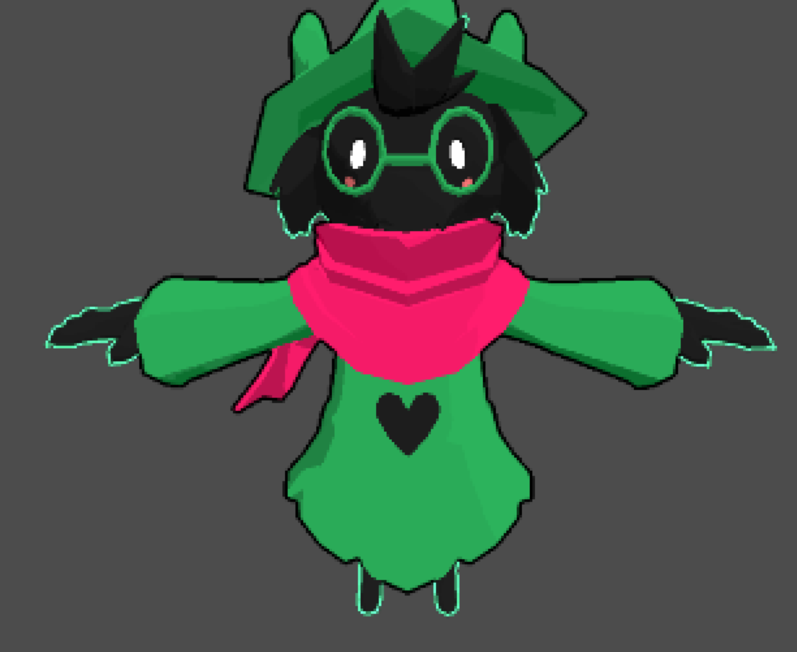

# Ralsei Shader Test

    
    

A mixture of effects I found interesting from [this BL Forums topic](https://forum.blockland.us/index.php?topic=61695.msg9945820#msg9945820) but implemented in THREE.js

Live Demo: https://cobertos.github.io/ralsei-shader-test/index.html

Ralsei asset from: https://sketchfab.com/models/aff73d33cd7e4a40a641aa89089ff900

